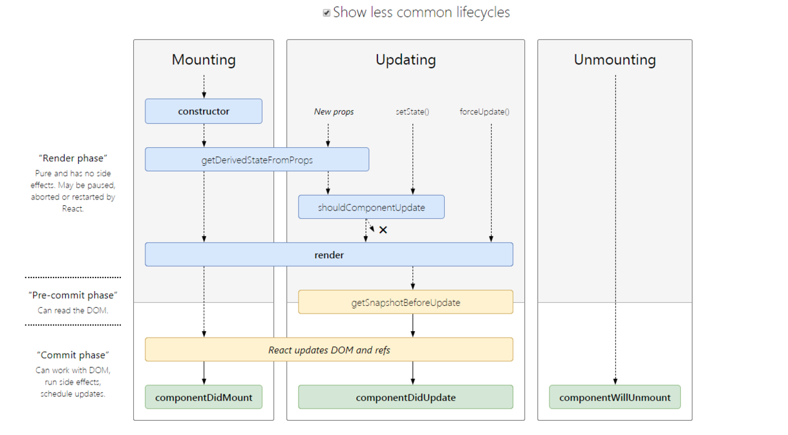

# react 面试题

### 1. 写React/Vue项目时，为什么要在列表组件中写key，作用是什么
+ 不带key，可以更高效的**就地复用**，diff速度也更快，但会隐藏一些副作用，比如不会产生过渡效果，或者某些节点绑定有数据状态，出现状态错位。
+ 带key的作用是：
1. 解决**就地复用**的一些副作用。
2. key是给每一个vnode的唯一id,可以依靠key,更准确, 更快的拿到oldVnode中对应的vnode节点，利用key的唯一性生成map对象来获取对应节点，比遍历方式更快。

### 2. react有哪些组件？
1. 函数/无状态/展示组件
+ 函数或无状态组件是一个纯函数，它可接受接受参数，并返回react元素。这些都是没有任何副作用的纯函数。这些组件没有状态或生命周期方法。
2. 类/有状态组件
+ 类或有状态组件具有状态和生命周期方可能通过setState()方法更改组件的状态。类组件是通过扩展React创建的。它在构造函数中初始化，也可能有子组件,
3. 受控组件
+ 受控组件是在 React 中处理输入表单的一种技术。表单元素通常维护它们自己的状态，而react则在组件的状态属性中维护状态。我们可以将两者结合起来控制输入表单。这称为受控组件。因此，在受控组件表单中，数据由React组件处理。
4. 非受控组件
+ 大多数情况下，建议使用受控组件。有一种称为非受控组件的方法可以通过使用Ref来处理表单数据。在非受控组件中，Ref用于直接从DOM访问表单值，而不是事件处理程序。
5. 容器组件
+ 容器组件是处理获取数据、订阅 redux 存储等的组件。它们包含展示组件和其他容器组件，但是里面从来没有html。
6. 高阶组件
+ 高阶组件是将组件作为参数并生成另一个组件的组件。 Redux connect是高阶组件的示例。 这是一种用于生成可重用组件的强大技术。

### 3. 什么是函数式编程？
+ 函数式编程是声明式编程的一部分。javascript中的函数是第一类公民，这意味着函数是数据，你可以像保存变量一样在应用程序中保存、检索和传递这些函数。
+ 函数式编程有如下核心概念：
1. 不可变性(Immutability)
+ 不可变性意味着不可改变。 在函数式编程中，你无法更改数据，也不能更改。 如果要改变或更改数据，则必须复制数据副本来更改。**Object.assign**
2. 纯函数
+ 纯函数是始终接受一个或多个参数并计算参数并返回数据或函数的函数。 它没有副作用，例如设置全局状态，更改应用程序状态，它总是将参数视为不可变数据。
3. 数据转换
+ 例如map、filter、reduce方法，所有这些函数都不改变现有的数据，而是返回新的数组或对象。
4. 高阶函数
+ Array.map，Array.filter和Array.reduce是高阶函数，因为它们将函数作为参数。
5. 递归
+ 递归是一种函数在满足一定条件之前调用自身的技术。
6. 组合
+ 在React中，我们将功能划分为小型可重用的纯函数，我们必须将所有这些可重用的函数放在一起，最终使其成为产品。 将所有较小的函数组合成更大的函数，最终，得到一个应用程序，这称为组合。

### 4. React 与 Angular 有何不同？
+ Angular是一个成熟的MVC框架，带有很多特定的特性，比如服务、指令、模板、模块、解析器等等。React是一个非常轻量级的库，它只关注MVC的视图部分。
+ Angular遵循两个方向的数据流，而React遵循从上到下的单向数据流。React在开发特性时给了开发人员很大的自由，例如，调用API的方式、路由等等。我们不需要包括路由器库，除非我们需要它在我们的项目。

### 5. 什么是Virtual DOM及其工作原理
+ 虚拟DOM只不过是真实 DOM 的 javascript对象表示。 与更新真实 DOM 相比，更新 javascript 对象更容易，更快捷。

### 6. 什么是 JSX
+ JSX是javascript的语法扩展。它就像一个拥有javascript全部功能的模板语言。它生成React元素，这些元素将在DOM中呈现。React建议在组件使用JSX。在JSX中，我们结合了javascript和HTML，并生成了可以在DOM中呈现的react元素。

### 7. React最新的生命周期是怎样的?
+ React 16之后有三个生命周期被废弃,官方计划在17版本完全删除这三个函数，只保留UNSAVE_前缀的三个函数，目的是为了向下兼容，但是对于开发者而言应该尽量避免使用他们，而是使用新增的生命周期函数替代它们
1. componentWillMount
2. componentWillReceiveProps
3. componentWillUpdate
+ 目前React 16.8 +的生命周期分为三个阶段,分别是挂载阶段、更新阶段、卸载阶段
+ **挂载阶段：**
1. constructor: 构造函数，最先被执行,我们通常在构造函数里初始化state对象或者给自定义方法绑定this。
2. getDerivedStateFromProps: static getDerivedStateFromProps(nextProps, prevState),这是个静态方法,当我们接收到新的属性想去修改我们state，可以使用getDerivedStateFromProps。
3. render: render函数是纯函数，只返回需要渲染的东西，不应该包含其它的业务逻辑,可以返回原生的DOM、React组件、Fragment、Portals、字符串和数字、Boolean和null等内容。
4. componentDidMount: 组件装载之后调用，此时我们可以获取到DOM节点并操作，比如对canvas，svg的操作，服务器请求，订阅都可以写在这个里面，但是记得在componentWillUnmount中取消订阅。
+ **更新阶段：**
1. getDerivedStateFromProps: 此方法在更新和挂载阶段都可能会调用。
2. shouldComponentUpdate: shouldComponentUpdate(nextProps, nextState),有两个参数nextProps和nextState，表示新的属性和变化之后的state，返回一个布尔值，true表示会触发重新渲染，false表示不会触发重新渲染，默认返回true,我们通常利用此生命周期来优化React程序性能
3. render: 更新阶段也会触发此生命周期
4. getSnapshotBeforeUpdate: getSnapshotBeforeUpdate(prevProps, prevState),这个方法在render之后，componentDidUpdate之前调用，有两个参数prevProps和prevState，表示之前的属性和之前的state，这个函数有一个返回值，会作为第三个参数传给componentDidUpdate，如果你不想要返回值，可以返回null，此生命周期必须与componentDidUpdate搭配使用
5. componentDidUpdate: componentDidUpdate(prevProps, prevState, snapshot),该方法在getSnapshotBeforeUpdate方法之后被调用，有三个参数prevProps，prevState，snapshot，表示之前的props，之前的state，和snapshot。第三个参数是getSnapshotBeforeUpdate返回的,如果触发某些回调函数时需要用到 DOM 元素的状态，则将对比或计算的过程迁移至 getSnapshotBeforeUpdate，然后在 componentDidUpdate 中统一触发回调或更新状态。
+ **卸载阶段：**
1. componentWillUnmount: 当我们的组件被卸载或者销毁了就会调用，我们可以在这个函数里去清除一些定时器，取消网络请求，清理无效的DOM元素等垃圾清理工作

