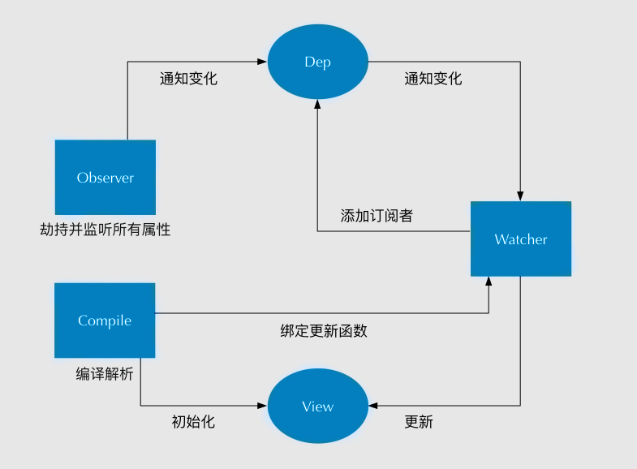

## vue面试题
参考：[Vue面试中，经常会被问到的面试题/Vue知识点整理](https://segmentfault.com/a/1190000016344599)

### 1.vue 动态路由加载
在vue-router对象中首先初始化公共路由，比如（404，login）等，然后在用户登陆成功，根据用户的角色信息，获取对应权限菜单信息menuList，并将后台返回的menuList转换成我们需要的router数据结构，然后通过vue-router2.2新添的router.addRouter(routes)方法，同时我们可以将转后的路由信息保存于vuex，这样我们可以在我们的SideBar组件中获取我们的全部路由信息，并且渲染我们的左侧菜单栏，让动态路由实现。

+ 登录：当用户填写完账号和密码后向服务端验证是否正确，验证通过之后，服务端会返回一个token，拿到token之后（我会将这个token存贮到cookie中，保证刷新页面后能记住用户登录状态），前端会根据token再去拉取一个 user_info 的接口来获取用户的详细信息（如用户权限，用户名等等信息）。
+ 权限验证：通过token获取用户对应的 role，动态根据用户的 role 算出其对应有权限的路由，通过router.addRoutes 动态挂载这些路由。


参考： [vue后台管理之动态加载路由的方法](https://www.jb51.net/article/145531.htm)

### 2. webpack中alias配置
作用:设置别名是为了让后续引用的地方减少路径的复杂度
```javascript
//index.vue 里，正常引用 A 组件：
import A from '../../components/a.vue'
//如果设置了 alias 后。
alias: {
  'vue$': 'vue/dist/vue.esm.js',
  '@': resolve('src')
}
import A from '@/components/a.vue'
```

### 3.vue如何实现双向绑定
+ vue数据双向绑定是通过 **数据劫持** 结合 **发布者-订阅者模式** 的方式来实现的.
+ vue是通过Object.defineProperty()来实现数据劫持的。它可以来控制一个对象属性的一些特有操作，比如读写权、是否可以枚举.有get和set两个方法。
+ 实现mvvm主要包含两个方面，数据变化更新视图，视图变化更新数据。视图更新数据其实可以通过事件监听即可，关键在于数据变化更新视图，通过Object.defineProperty( )对属性设置一个set函数，当数据改变了就会来触发这个函数，所以我们只要将一些需要更新的方法放在这里面就可以实现data更新view了。
+ 实现数据的双向绑定：
1. **实现一个监听器 Observer：** 对数据对象进行遍历，包括子属性对象的属性，利用 Object.defineProperty() 对属性都加上 setter 和 getter。这样的话，给这个对象的某个值赋值，就会触发 setter，那么就能监听到了数据变化
2. **实现一个解析器 Compile：** 解析 Vue 模板指令，将模板中的变量都替换成数据，然后初始化渲染页面视图，并将每个指令对应的节点绑定更新函数，添加监听数据的订阅者，一旦数据有变动，收到通知，调用更新函数进行数据更新。
3. **实现一个订阅者 Watcher：** Watcher 订阅者是 Observer 和 Compile 之间通信的桥梁 ，主要的任务是订阅 Observer 中的属性值变化的消息，当收到属性值变化的消息时，触发解析器 Compile 中对应的更新函数。
4. **实现一个订阅器 Dep：** 订阅器采用 发布-订阅 设计模式，用来收集订阅者 Watcher，对监听器 Observer 和 订阅者 Watcher 进行统一管理。


### 4. vue的生命周期
+ **beforecreated**  el、data、message未被初始化，此时可用于loading
+ **created** 完成了data、message的初始化
+ **beforeMount** 完成了el和data的初始化 ,但是el还是 {{message}}，这里就是应用的 Virtual DOM（虚拟Dom）技术，先把坑占住了。
+ **mounted** 完成挂载，渲染值。
+ **beforeUpdate** 可以监听到data的变化但是view层没有被重新渲染，view层的数据没有变化
+ **updated** 等到updated的时候 view层才被重新渲染，数据更新。
+ **beforeDestroy** 钩子函数在实例销毁之前调用。在这一步，实例仍然完全可用。
+ **destroyed** 钩子函数在Vue 实例销毁后调用。调用后，Vue 实例指示的所有东西都会解绑定，所有的事件监听器会被移除，所有的子实例也会被销毁。


### 5.vue的父子组件如何通信的
+ 父组件是通过props属性给子组件通信
+ 子组件通过触发事件来改变父组件的数据（this.$emit(method,data))。父组件通过监听子组件触发的事件，来调用方法，接收数据。
+ 兄弟组件的通信，采用观察者模式。新建一个第三方实例。
```JavaScript
//组件他哥
<div @click="ge"></div>
methods: {
    ge() {
        vm.$emit('blur','sichaoyun'); //触发事件
    }
}
//组件小弟
vm.$on('blur', (arg) => {
        this.test= arg; // 接收
});
```

### 6.Vue的路由实现：hash模式 和 history模式
+ **hash模式：** 在浏览器中符号“#”，#以及#后面的字符称之为hash，用window.location.hash读取；
+ 特点：hash虽然在URL中，但不被包括在HTTP请求中；用来指导浏览器动作，对服务端安全无用，hash不会重加载页面。hash 模式下，仅 hash 符号之前的内容会被包含在请求中，如 http://www.xxx.com，因此对于后端来说，即使没有做到对路由的全覆盖，也不会返回 404 错误。
+ **history模式：** history采用HTML5的新特性；且提供了两个新方法：pushState（），replaceState（）可以对浏览器历史记录栈进行修改，以及popState事件的监听到状态变更。
+ history 模式下，前端的 URL 必须和实际向后端发起请求的 URL 一致，如 http://www.xxx.com/items/id。后端如果缺少对 /items/id 的路由处理，将返回 404 错误。

### 7.vue-cli如何新增自定义指令？
```JavaScript
//创建局部指令
var app = new Vue({
    el: '#app',
    data: {    
    },
    // 创建指令(可以多个)
    directives: {
        // 指令名称
        dir1: {
            inserted(el) {
                el.style.width = '200px';
            }}}})
//创建全局指令
Vue.directive('dir2', {
    inserted(el) {
        console.log(el);
    }
})
//指令的使用
<div v-dir1></div>
```

### 8.vue如何自定义一个过滤器？
```JavaScript
<div id="app">
     <input type="text" v-model="msg" />
     {{msg| capitalize }}
</div>

var vm=new Vue({
    el:"#app",
    data:{
        msg:''
    },
    filters: {
      capitalize: function (value) {
        if (!value) return ''
        value = value.toString()
        return value.charAt(0).toUpperCase() + value.slice(1)
      }
    }
})
```

### 9.对keep-alive 的了解？
+ keep-alive是 Vue 内置的一个组件，可以使被包含的组件保留状态，或避免重新渲染。
+ 在vue 2.1.0 版本之后，keep-alive新加入了两个属性: include(包含的组件缓存) 与 exclude(排除的组件不缓存，优先级大于include) 。

### 10. vue中 key 值的作用？
+ 当 Vue.js 用 v-for 正在更新已渲染过的元素列表时，它默认用“就地复用”策略。如果数据项的顺序被改变，Vue 将不会移动 DOM 元素来匹配数据项的顺序， 而是简单复用此处每个元素，并且确保它在特定索引下显示已被渲染过的每个元素。key的作用主要是为了高效的更新虚拟DOM。

### 11.什么是vue的计算属性？
在模板中放入太多的逻辑会让模板过重且难以维护，在需要对数据进行复杂处理，且可能多次使用的情况下，尽量采取计算属性的方式。好处：①使得数据处理结构清晰；②依赖于数据，数据更新，处理结果自动更新；③计算属性内部this指向vm实例；④在template调用时，直接写计算属性名即可；⑤常用的是getter方法，获取数据，也可以使用set方法改变数据；⑥相较于methods，不管依赖的数据变不变，methods都会重新计算，但是依赖数据不变的时候computed从缓存中获取，不会重新计算。

### 12. vuex原理
+ vuex的store有State、 Getter、Mutation 、Action、 Module五种属性；
+ **state** 为单一状态树，在state中需要定义我们所需要管理的数组、对象、字符串等等
+ **getters** 类似vue的计算属性，主要用来过滤一些数据。
+ **mutation** 更改store中state状态的唯一方法就是提交mutation，store.commit。
+ **action** actions可以理解为通过将mutations里面处里数据的方法变成可异步的处理数据的方法，简单的说就是异步操作数据。view 层通过 store.dispath 来分发 action。
+ **module** module其实只是解决了当state中很复杂臃肿的时候，module可以将store分割成模块，每个模块中拥有自己的state、mutation、action和getter。

### 13. vue数据双向绑定
```JavaScript
<body>
    <div id="app">
    <input type="text" id="txt">
    <p id="show"></p>
</div>
</body>
<script type="text/javascript">
    var obj = {}
    Object.defineProperty(obj, 'txt', {
        get: function () {
            return obj
        },
        set: function (newValue) {
            document.getElementById('txt').value = newValue
            document.getElementById('show').innerHTML = newValue
        }
    })
    document.addEventListener('keyup', function (e) {
        obj.txt = e.target.value
    })
</script>
```

### 14. 父子组件如何通信，兄弟组件如何通信
1. props/$emit+v-on: 通过props将数据自上而下传递，而通过$emit和v-on来向上传递信息。
2. EventBus: 通过EventBus进行信息的发布与订阅。这种方法通过一个空的 Vue 实例作为中央事件总线（事件中心），用它来触发事件和监听事件，从而实现任何组件间的通信，包括父子、隔代、兄弟组件。
3. vuex: 是全局数据管理库，可以通过vuex管理全局的数据流。
4. $attrs/$listeners: Vue2.4中加入的$attrs/$listeners可以进行跨级的组件通信
5. provide/inject：以允许一个祖先组件向其所有子孙后代注入一个依赖，不论组件层次有多深，并在起上下游关系成立的时间里始终生效，这成为了跨组件通信的基础

### 15. Proxy与Object.defineProperty的优劣对比?
+ **Object.defineProperty的缺点**
1. 无法监听数组变化。Vue的文档提到了Vue是可以检测到数组变化的，但是只有以下八种方法,vm.items[indexOfItem] = newValue这种是无法检测的。
2. 只能劫持对象的属性,因此我们需要对每个对象的每个属性进行遍历，如果属性值也是对象那么需要深度遍历,显然能劫持一个完整的对象是更好的选择。
+ **Proxy的优点：**
1. Proxy可以直接监听对象而非属性
2. Proxy可以直接监听数组的变化
3. Proxy有多达13种拦截方法,不限于apply、ownKeys、deleteProperty、has等等是Object.defineProperty不具备的
4. Proxy返回的是一个新对象,我们可以只操作新的对象达到目的,而Object.defineProperty只能遍历对象属性直接修改
5. Proxy作为新标准将受到浏览器厂商重点持续的性能优化，也就是传说中的新标准的性能红利。
+ **Object.defineProperty的优点 && Proxy的缺点**
1. 兼容性好，支持 IE9，而 Proxy 的存在浏览器兼容性问题,而且无法用 polyfill 磨平，因此 Vue 的作者才声明需要等到下个大版本( 3.0 )才能用 Proxy 重写。

### 16. Vue 的父组件和子组件生命周期钩子函数执行顺序？
Vue 的父组件和子组件生命周期钩子函数执行顺序可以归类为以下 4 部分：
+ **加载渲染过程**：
+ 父 beforeCreate -> 父 created -> 父 beforeMount -> 子 beforeCreate -> 子 created -> 子 beforeMount -> 子 mounted -> 父 mounted
+ **子组件更新过程**
+ 父 beforeUpdate -> 子 beforeUpdate -> 子 updated -> 父 updated
+ **父组件更新过程**
+ 父 beforeUpdate -> 父 updated
+ **销毁过程**
+ 父 beforeDestroy -> 子 beforeDestroy -> 子 destroyed -> 父 destroyed

### 17. 在哪个生命周期内调用异步请求？
+ 可以在钩子函数 created、beforeMount、mounted 中进行调用，因为在这三个钩子函数中，data 已经创建，可以将服务端端返回的数据进行赋值。但是本人推荐在 created 钩子函数中调用异步请求，因为在 created 钩子函数中调用异步请求有以下优点：
1. 能更快获取到服务端数据，减少页面 loading 时间；
2. ssr 不支持 beforeMount 、mounted 钩子函数，所以放在 created 中有助于一致性；

### 18. 父组件可以监听到子组件的生命周期吗？
+ 比如有父组件 Parent 和子组件 Child，如果父组件监听到子组件挂载 mounted 就做一些逻辑处理，可以通过以下写法实现：
```javascript
// Parent.vue
<Child @mounted="doSomething"/>
    
// Child.vue
mounted() {
  this.$emit("mounted");
}
```
+ 以上需要手动通过 $emit 触发父组件的事件，更简单的方式可以在父组件引用子组件时通过 @hook 来监听即可，如下所示：
```javascript
//  Parent.vue
<Child @hook:mounted="doSomething" ></Child>

doSomething() {
   console.log('父组件监听到 mounted 钩子函数 ...');
},
    
//  Child.vue
mounted(){
   console.log('子组件触发 mounted 钩子函数 ...');
},    
    
// 以上输出顺序为：
// 子组件触发 mounted 钩子函数 ...
// 父组件监听到 mounted 钩子函数 ...     
```

### 19. 谈谈你对 keep-alive 的了解？
+ keep-alive 是 Vue 内置的一个组件，可以使被包含的组件保留状态，避免重新渲染 ，其有以下特性：
1. 一般结合路由和动态组件一起使用，用于缓存组件；
2. 提供 include 和 exclude 属性，两者都支持字符串或正则表达式， include 表示只有名称匹配的组件会被缓存，exclude 表示任何名称匹配的组件都不会被缓存 ，其中 exclude 的优先级比 include 高；
3. 对应两个钩子函数 activated 和 deactivated ，当组件被激活时，触发钩子函数 activated，当组件被移除时，触发钩子函数 deactivated。

### 20. 组件中 data 为什么是一个函数？
因为组件是用来复用的，且 JS 里对象是引用关系，如果组件中 data 是一个对象，那么这样作用域没有隔离，子组件中的 data 属性值会相互影响，如果组件中 data 选项是一个函数，那么每个实例可以维护一份被返回对象的独立的拷贝，组件实例之间的 data 属性值不会互相影响；而 new Vue 的实例，是不会被复用的，因此不存在引用对象的问题

### 21. 使用过 Vue SSR 吗？说说 SSR？
+ SSR大致的意思就是vue在客户端将标签渲染成的整个 html 片段的工作在服务端完成，服务端形成的html 片段直接返回给客户端这个过程就叫做**服务端渲染**。
+ 服务端渲染 SSR 的优缺点如下：
+ **优点：**
1. 更好的 SEO： 因为 SPA 页面的内容是通过 Ajax 获取，而搜索引擎爬取工具并不会等待 Ajax 异步完成后再抓取页面内容，所以在 SPA 中是抓取不到页面通过 Ajax 获取到的内容；而 SSR 是直接由服务端返回已经渲染好的页面（数据已经包含在页面中），所以搜索引擎爬取工具可以抓取渲染好的页面；
2. 更快的内容到达时间（首屏加载更快）： SPA 会等待所有 Vue 编译后的 js 文件都下载完成后，才开始进行页面的渲染，文件下载等需要一定的时间等，所以首屏渲染需要一定的时间；SSR 直接由服务端渲染好页面直接返回显示，无需等待下载 js 文件及再去渲染等，所以 SSR 有更快的内容到达时间；
+ **缺点：**
1. 更多的开发条件限制： 例如服务端渲染只支持 beforCreate 和 created 两个钩子函数，这会导致一些外部扩展库需要特殊处理，才能在服务端渲染应用程序中运行；并且与可以部署在任何静态文件服务器上的完全静态单页面应用程序 SPA 不同，服务端渲染应用程序，需要处于 Node.js server 运行环境；
2. 更多的服务器负载：在 Node.js  中渲染完整的应用程序，显然会比仅仅提供静态文件的  server 更加大量占用CPU 资源 (CPU-intensive - CPU 密集)，因此如果你预料在高流量环境 ( high traffic ) 下使用，请准备相应的服务器负载，并明智地采用缓存策略。

### 22. 能说下 vue-router 中常用的 hash 和 history 路由模式实现原理吗？
+ **hash 模式的实现原理**
1. URL 中 hash 值只是客户端的一种状态，也就是说当向服务器端发出请求时，hash 部分不会被发送；
2. hash 值的改变，都会在浏览器的访问历史中增加一个记录。因此我们能通过浏览器的回退、前进按钮控制hash 的切换；
3. 可以通过 a 标签，并设置 href 属性，当用户点击这个标签后，URL 的 hash 值会发生改变；或者使用  JavaScript 来对 loaction.hash 进行赋值，改变 URL 的 hash 值；
4. 我们可以使用 hashchange 事件来监听 hash 值的变化，从而对页面进行跳转（渲染）。
+ **history 模式的实现原理**
1. HTML5 提供了 History API 来实现 URL 的变化。其中做最主要的 API 有以下两个：history.pushState() 和 history.repalceState()。这两个 API 可以在不进行刷新的情况下，操作浏览器的历史纪录。唯一不同的是，前者是新增一个历史记录，后者是直接替换当前的历史记录，如下所示：
2. 我们可以使用 popstate  事件来监听 url 的变化，从而对页面进行跳转（渲染）；
3. history.pushState() 或 history.replaceState() 不会触发 popstate 事件，这时我们需要手动触发页面跳转（渲染）。

### 23. Vue 怎么用 vm.$set() 解决对象新增属性不能响应的问题 ？
受现代 JavaScript 的限制 ，Vue 无法检测到对象属性的添加或删除。由于 Vue 会在初始化实例时对属性执行 getter/setter 转化，所以属性必须在 data 对象上存在才能让 Vue 将它转换为响应式的。但是 Vue 提供了 Vue.set (object, propertyName, value) / vm.$set (object, propertyName, value)  来实现为对象添加响应式属性。
```javascript
export function set (target: Array<any> | Object, key: any, val: any): any {
  // target 为数组  
  if (Array.isArray(target) && isValidArrayIndex(key)) {
    // 修改数组的长度, 避免索引>数组长度导致splcie()执行有误
    target.length = Math.max(target.length, key)
    // 利用数组的splice变异方法触发响应式  
    target.splice(key, 1, val)
    return val
  }
  // key 已经存在，直接修改属性值  
  if (key in target && !(key in Object.prototype)) {
    target[key] = val
    return val
  }
  const ob = (target: any).__ob__
  // target 本身就不是响应式数据, 直接赋值
  if (!ob) {
    target[key] = val
    return val
  }
  // 对属性进行响应式处理
  defineReactive(ob.value, key, val)
  ob.dep.notify()
  return val
}
```
1. 如果目标是数组，直接使用数组的 splice 方法触发响应式；
2. 如果目标是对象，会先判读属性是否存在、对象是否是响应式，最终如果要对属性进行响应式处理，则是通过调用  defineReactive 方法进行响应式处理（ defineReactive 方法就是  Vue 在初始化对象时，给对象属性采用 Object.defineProperty 动态添加 getter 和 setter 的功能所调用的方法）
